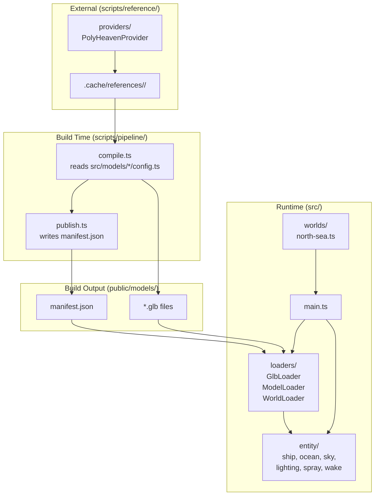
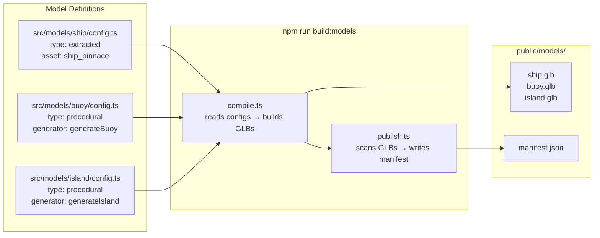
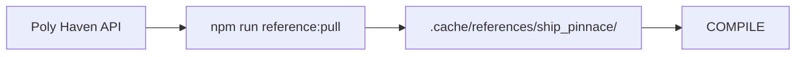
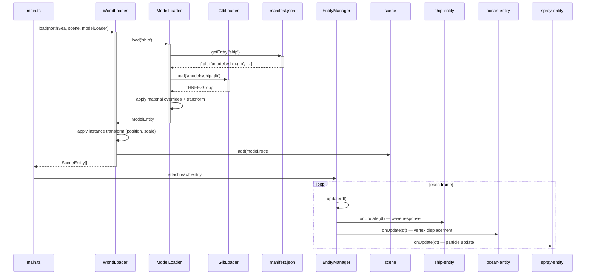
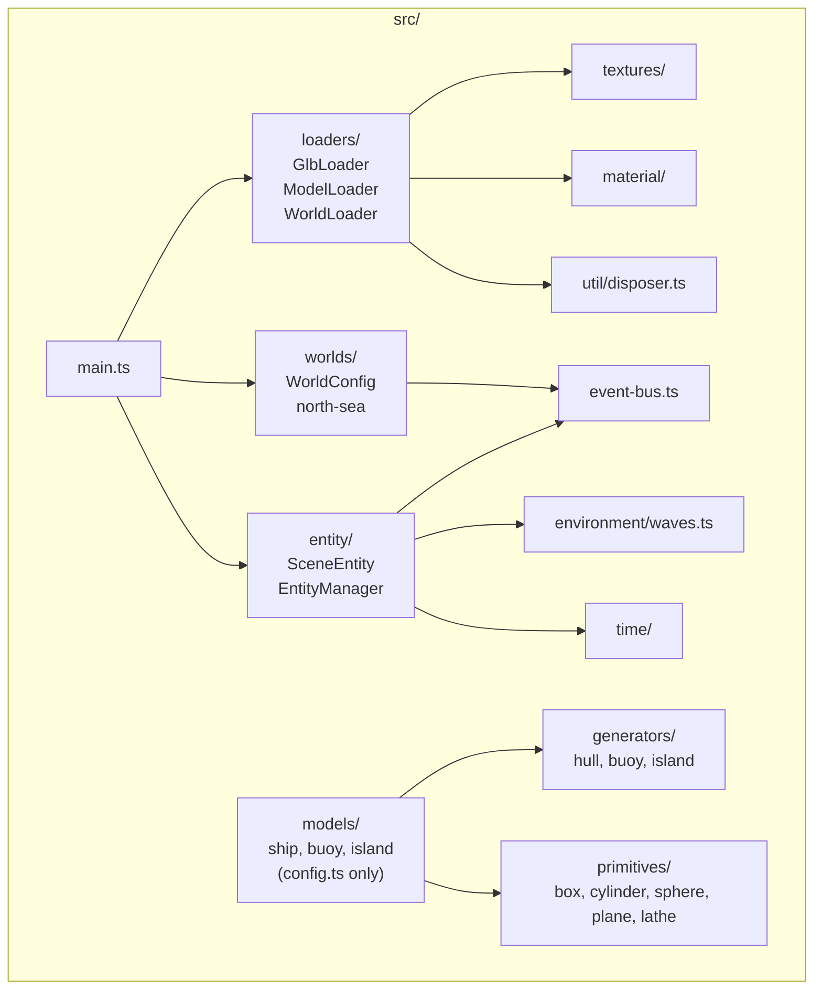

# Architecture

## Overview



## Pipeline



### Stage breakdown

| Stage | Script | Input | Output | What it does |
|---|---|---|---|---|
| compile | `compile.ts` | `src/models/*/config.ts` + `.cache/references/` | `public/models/*.glb` | Runs generators, reads reference data, bakes materials/textures into GLB |
| publish | `publish.ts` | `public/models/*.glb` + model configs | `public/models/manifest.json` | Builds runtime catalog with paths, overrides, metadata |

### Reference downloads (one-time setup)



External assets are downloaded once into `.cache/references/`. The pipeline reads from this cache but never calls external APIs.

## Runtime flow



## Module dependency graph



## Directory layout

```
src/
  primitives/       ← buildBox(), buildCylinder(), buildSphere()… (pure geometry)
  generators/       ← generateHull(), generateBuoy(), generateIsland()… (parametrized)
  models/           ← <id>/config.ts (model definitions, discovered by convention)
    ship/config.ts     extracted — reads from .cache/references/ship_pinnace/
    buoy/config.ts     procedural — calls generateBuoy()
    island/config.ts   procedural — calls generateIsland()
  worlds/           ← <name>.ts (scene composition)
    north-sea.ts       ship at origin, buoys at offsets, island far
  loaders/          ← Runtime GLB loading + caching
    glb-loader.ts      wraps THREE.GLTFLoader
    model-loader.ts    resolves refs → loads GLBs → applies overrides
    world-loader.ts    loads WorldConfig → places models in scene
    catalog.ts         reads manifest.json
  entity/           ← SceneEntity lifecycle (unchanged from ADR-002)
    ship-entity.ts     wave response, emits position events
    ocean-entity.ts    wave-displaced grid
    sky-entity.ts      sky dome + horizon ring
    lighting-entity.ts sun + hemisphere + fill lights
    spray-entity.ts    bow spray particles
    wake-entity.ts     trailing wake mesh
  model/            ← Core types + registry
    types.ts           ModelEntity, ModelSource
    registry.ts        singleton
  material/         ← Material cache
  textures/         ← Texture manifest + procedural fallbacks
  time/             ← WorldClock
  event-bus.ts      ← Typed events (attached, detached, position-changed)
  util/disposer.ts  ← Cleanup collector

scripts/
  pipeline/         ← Build pipeline (compile + publish)
    compile.ts         reads config.ts → produces GLBs
    publish.ts         scans GLBs → writes manifest.json
    types.ts           PipelineModelConfig types
    index.ts           orchestrator (--stage flag)
  reference/        ← External asset downloader
    pull.ts            downloads to .cache/references/
    providers/         AssetProvider interface + PolyHeaven adapter
  references.json   ← list of external assets

public/
  models/           ← Build output (gitignored)
    *.glb              Draco-compressed models
    manifest.json      runtime catalog
  textures/         ← Generated textures (gitignored)

.cache/
  references/       ← Raw external assets (gitignored)
```

## Data flow

```
Source of truth          Build pipeline          Runtime
─────────────────        ─────────────          ───────
src/models/*/config.ts ─→ compile.ts ─→ .glb ─→ ModelLoader ─→ SceneEntity
scripts/references.json ─→ pull.ts ─→ .cache/       ↑
src/generators/* ───────→ compile.ts ────┘          |
src/primitives/*                              manifest.json ← publish.ts
```

## Model config format

Each model lives in `src/models/<id>/config.ts`:

```typescript
// Extracted — geometry from external reference
export default {
  type: 'extracted',
  provider: 'polyhaven',
  asset: 'ship_pinnace',
  textureKeys: { hull: 'ccivHull', deck: 'ccivDeck', … },
  materialOverrides: { hull: { color: 0x1c160e, roughness: 0.92 }, … },
  transform: { scale: 2.7 },
} satisfies ExtractedModelDef;

// Procedural — geometry from generator function
export default {
  type: 'procedural',
  generator: '../../generators/buoy',
  params: { height: 3, radius: 0.8, poleHeight: 1.5 },
  material: { color: 0xff4422, roughness: 0.6 },
} satisfies ProceduralModelDef;

// Composite — assembled from primitives + sub-models
export default {
  type: 'composite',
  parts: [
    { primitive: 'cylinder', params: { radius: 2, height: 20 }, at: [0, 10, 0] },
    { model: 'buoy', at: [0, 0, 0] },
  ],
} satisfies CompositeModelDef;
```

## ADRs

- [ADR-001: Model Abstraction Layer](../docs/adr/ADR-001.md)
- [ADR-002: Scene Entity Lifecycle](../docs/adr/ADR-002.md)
- [ADR-003: Asset Pipeline](../docs/adr/ADR-003.md)
